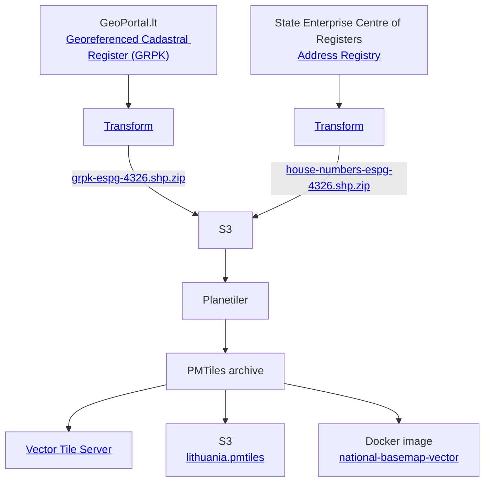

# National Basemap of Lithuania

Revolutionizing mapping technology for Lithuania with a free and completely open-source vector Basemap of Lithuania with
no
restrictions on usage. This project utilizes cutting-edge vector mapping technology, akin to giants like Google Maps,
Apple Maps, and Mapbox, and is compliant with the OpenMapTiles standard.

## Key features

1. **Lightning-Fast Updates**: vector basemap updates are lightning-fast, taking approximately ~2 minutes to build on an
   M1 MacBook and ~6 minutes on a free GitHub runner.
2. **Compact and Efficient**: Unlike traditional raster-based technologies, vector basemap of Lithuania occupies only
   ~350 MB as a single file. Say goodbye to managing millions of image files!
3. **Efficient Data Delivery**: The average vector tile size is approximately 20 KB[^1], with a maximum tile size of
   less than 80 KB. This ensures lightning-fast data delivery over the internet, resulting in smoother and
   more responsive maps.
4. **Instant Style Changes**: Customize your maps on the fly with instant style changes. No more waiting for complete
   rebuilds as with raster based maps.
5. **Precision and Accuracy**: Utilizing data from the Georeferenced Cadastral
   Register ([GRPK](https://www.geoportal.lt/geoportal/web/georeferencinio-pagrindo-kadastras-grpk))
   and [address registry](https://www.registrucentras.lt/p/1187), vector basemap offers unparalleled accuracy.
6. **Infrastructure Flexibility**: Seamlessly integrate vector basemap into your existing infrastructure with just one
   style url or self-host it independently. Enjoy the freedom to choose what works best for you.
7. **Various Self-Hosting Options**: Explore multiple self-hosting options, including hosting a single
   ~350MB [PMTiles](https://docs.protomaps.com/pmtiles/) file and style files in your S3
   or file storage. Or using our provided docker image based on Martin tile server.
8. **OpenMapTiles Standard**: We adhere to the [OpenMapTiles](https://openmaptiles.org/about/) standard, allowing
   effortless integration of various
   open-source styles, including unconventional ones like the [Pirate style](https://openmaptiles.org/styles/) 🏴‍☠️
9. **Easy Usage**: With [Pseudo-Mercator](https://en.wikipedia.org/wiki/Web_Mercator_projection) projection (EPSG:3857),
   integration is seamless. Vector basemap aligns effortlessly with popular map services like Google Maps and
   OpenStreetMap.
10. **Completely Open Source and Free**: Join our community of contributors and users in shaping the future of mapping.
    Everything, from the basemap building process to its usage, is open-source and free of restrictions.

[^1]: 20 KB is gzipped average vector tile size is calculated using weighted average based on OSM traffic. It wouldn't
be fair to take average of all tiles, because tile sizes of sea are less than 1 KB.

## Usage

Using vector basemap is straightforward. Just follow these steps:

1. **Choose a Style**: Select the style you prefer from the available options listed [below](#styles).

2. **Integrate with Your Library**: Incorporate the chosen style into your favorite mapping library.

Here's a basic example using OpenLayers and the [ol-mapbox-style](https://github.com/openlayers/ol-mapbox-style)
library:

```js
import Map from 'ol/Map.js';
import { MapboxVectorLayer } from 'ol-mapbox-style';

const map = new Map({
	target: 'map',
	layers: [
		new MapboxVectorLayer({
			styleUrl: 'https://basemap.startupgov.lt/vector/styles/bright/style.json'
		})
	]
});
```

You can follow a similar process with [MapLibre GL JS](https://maplibre.org/maplibre-gl-js/docs/) or any other mapping
library you prefer.

### Styles

Currently, the following styles are available:

- **Topographic (Light)**: Offers detailed data representation. Style
  URL: `https://basemap.startupgov.lt/vector/styles/bright/style.json` (based
  on [OSM Bright](https://openmaptiles.org/styles/#osm-bright)).
- **Gray**: Provides a subtle basemap. Style URL: `https://basemap.startupgov.lt/vector/styles/positron/style.json` (
  based on [Positron](https://openmaptiles.org/styles/#positron)).

You can explore these styles and their features using [Maputnik](https://maplibre.org/maputnik/#6/55.59/23.54). These
styles are already utilized by the BĮIP team in production.

Additionally, the basemap data source is compatible with the OpenMapTiles standard, allowing you to utilize any
OpenMapTiles compatible style. For instance, you can use any styles from
the [OpenMapTiles styles](https://openmaptiles.org/styles/).

### PMTiles

If you need to use vector basemap offline or prefer to avoid using a tile server, you can directly read PMTiles
archives.

The latest stable basemap PMTiles archive is hosted
at `https://cdn.startupgov.lt/tiles/vector/pmtiles/lithuania.pmtiles`. You can
inspect it using
the [PMTiles viewer](https://protomaps.github.io/PMTiles/?url=https%3A%2F%2Fcdn.startupgov.lt%2Ftiles%2Fvector%2Fpmtiles%2Flithuania.pmtiles).

For instructions on reading PMTiles directly, refer to
the [PMTiles in the browser](https://docs.protomaps.com/pmtiles/maplibre) documentation.

## Self-hosting

You have the option to host the vector basemap on your own infrastructure.

### Vector Tiles

Utilize the provided Docker
image [national-basemap-vector](https://github.com/govlt/national-basemap/pkgs/container/national-basemap-vector),
which includes vector tiles, fonts, and sprites, enabling it to serve vector tiles on-the-fly.

Here's an example of its usage with Docker Compose:

```yaml
services:
  national-basemap-vector:
    image: ghcr.io/govlt/national-basemap-vector:stable
    pull_policy: always
    restart: unless-stopped
    environment:
      # Change to your host
      HOST: https://vector.startupgov.lt
    ports:
        - "80:80"
    healthcheck:
      test: [ "CMD-SHELL", "wget --no-verbose --tries=1 --spider http://localhost:80/health || exit 1" ]
      interval: 5s
      timeout: 3s
      start_period: 5s
      retries: 5
```

### PMTiles

Periodically download the PMTiles archive from `https://cdn.startupgov.lt/tiles/vector/pmtiles/lithuania.pmtiles` to
your own S3
or file storage and utilize it as needed.

## Recipes

### Extracting Basemap for a Specific Area

To extract a basemap for a specific area, you can utilize the [PMTiles CLI](https://docs.protomaps.com/pmtiles/cli).
This tool allows you to specify either a bounding box or a shape for extraction.

For example, if you want to extract the basemap for Vilnius Old Town, you can use the following command:

```bash
pmtiles extract https://cdn.startupgov.lt/tiles/vector/pmtiles/lithuania.pmtiles vilnius-old-town.pmtiles --bbox=25.276352,54.694638,25.302195,54.671628
```

The resulting basemap for Vilnius Old Town occupies less than 1 MB!

## Architecture



## Getting Started Development

To embark on your mapping journey, follow these simple steps:

- **Install Java 21+:** Ensure Java is installed on your system to power up the mapping engine.

## Instructions

### Generating basemap vector

To generate the vector basemap in PMTiles format, execute the following command:

```shell
make vector-basemap-generate
```

The generated PMTiles will be saved in `vector/data/output/lithuania.pmtiles`.

This process may take some time as data sources will be downloaded if they don't exist already.

#### Previewing

Before previewing, make sure you have [Docker](https://www.docker.com/get-started/) installed, preferably with Docker
Compose version 2.22 and later.

After generating the vector basemap, execute the following command:

```shell
make vector-basemap-preview
```

This will start:

- [Tileserver-GL](https://github.com/maptiler/tileserver-gl) at http://localhost:8080, which allows previewing PMTiles
  archive
  and styles;
- [Martin tile server](https://martin.maplibre.org/) at http://localhost:3000, serving PMTiles, fonts, and sprites.
  Visit http://localhost:3000/catalog for more details;
- [Maputnik](https://maplibre.org/maputnik/) at http://localhost:8000, used for style editing;

Note: Docker will watch all required directories, so you don't need to rerun this command once PMTiles are regenerated
or styles are changed.

## Contributing

Calling all GIS enthusiasts! Your expertise is invaluable to us. Whether you spot issues or have groundbreaking ideas,
feel free to open an issue or submit a pull request. Dive into
our [contribution guidelines](https://github.com/govlt/.github/blob/main/CONTRIBUTING.md) for more insights.

## License

This project is licensed under the [MIT License](./LICENSE), inviting you to explore, adapt, and contribute to our
mapping adventure!

Ready to map out Lithuania like never before? Join us on this exciting journey! 🌍✨
